## What is reproducible reporting?

* Imagine you get an E-Mail 

> Dear Claas
> 
> I was working on an experiment over the last two weeks. Now  
> I am currently analysis the data in R and writing down everything  
> for a report. Could you be so nice and read through my document  
> and tell me what you think about it so far?  
> -- *All the best Karl*  

<a href="assets/files/mardown_file_from_letter.Rmd" class="btn"><i class="icon-envelope"></i> Attachment</a>

* You are confused 
  - only one file?
  - which file type (.Rmd) ?
  
* But RStudio can open it!
  - you dont understand the syntax! (A mix of text and code?)

---

## What is reproducible reporting?

* You ask him

> Dear Claas
> 
> The ending (.Rmd) stands for R-Markdown. Markdown is a    
> lightweight markup language for text. It can be mixed   
> with R-Code and then we speak of R-Markdown. 
> 
> The document can be turned into an nicely formatted HTML page   
> where the code is executed and replaced by its output. Just install 
> the `knitr` R package and hit the knit to HTML button in your RStudio!  
> -- *All the best Karl*  

* .Rmd is R-Markdown
  - Textfile with markdown markup + R-Code
  - `knitr` can somehow turn this to HTML

* We follow his instructions and install `knitr`

--- bg:#EEE

## What is reproducible reporting?

* R-Studio way: Packages > Install Packages

    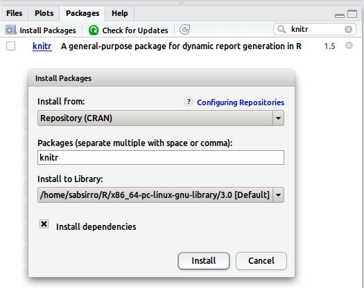

* On console:
  - `install.packages("knitr")`
  
<a href="http://www.rstudio.com/ide/download/" class="btn flushfooter"><i class="icon-download"></i> Get R-Studio</a>

--- bg:#EEE

## What is reproducible reporting?

* Knit his file: 
  - hit `knit HTML` button
  
  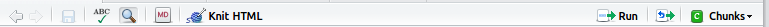
    
  - you get HTML output
  
  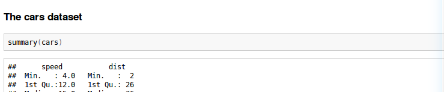

* You start to get the idea!
  - only 1 document
  - prevent copy + paste, always up to date
  - saves work time and your nerves, but HTML?

---

## What is reproducible reporting?

* Knitr R package (Yuhui Xie, 2012)
  * dynamic report generator 
  
* Markup languages:

* Markdown -> HTML
  - Knitr: .Rmd -> .md -> .html
  - Generate HTML reports (e.g research blogs, etc)

* LaTeX -> PDF
  - Knitr: .Rnw -> .tex -> .PDF
  - Generate PDF reports (for Ba./Ma. Thesis, etc.)

<a href="http://yihui.name/knitr/" class="btn flushfooter"><i class="icon-home"></i> Knitr</a>

---  

## What is reproducible reporting?

* Definition: 

> Reproducible reporting is a techique of research report generation    
> where we intermix the documentation with the analysis script. We   
> can turn a source document (e.g .Rmd) into nicely formatted output   
> documen. This supports the fundamental scientific aim of reproducibility.   
> Reproducibility means the ability to repeat an entire experiment or study,   
> either by the original researcher or by someone else working independently    
> on the same topic. Thus this form of report enables you - or anyone else    
> with access to that report document to easily reproduce your results.  

* Promotes:
  - Accuracy and correctness  
  => others check what we have done!
  - Extensibility and modfiability  
  => others can directly build on top of our work!

<a href="http://bit.ly/186LZpq" class="btn flushfooter"><i class="icon-book"></i> Read on</a>

---

## R-Markdown and R-Studio

* Integration:
  - Create a .Rmd file (file > new > R-Markdown)
  
      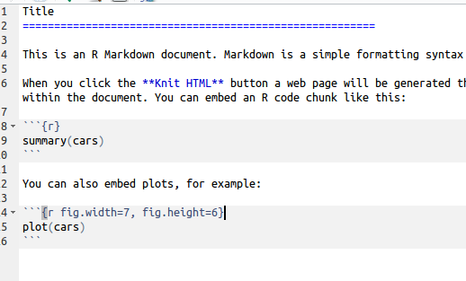
 
 - Content sensitive navigation options and syntax help:

      

---

## R-Markdown Syntax

* Optional metadata section (embraced by ---)
* Example: 

```
---
title: "This is my test title"
author: "Claas-Thido Pfaff"
date: "06.09.2014"
output: html_document
---
```
</br>
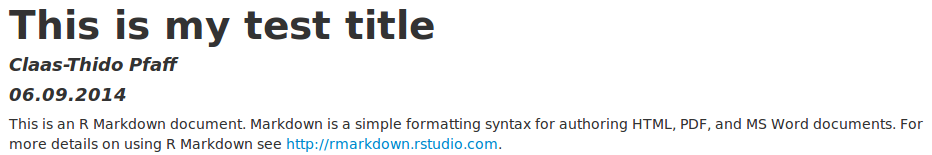

---

## Markdown Syntax (headers)

* Headers

  ```
  # H1
  ## H2
  ### H3
  ...
  ###### H6
  ```

  ```
  Some text above ....
  
  ### This is a h3 header 
  
  Some text below ...
  ```
  
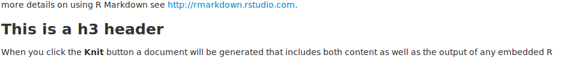

---

## Markdown Syntax (lists)

* Numbered list (digits) 

  ```
  1. Element one
  2. Element two
  3. Element three
  ```

</br>
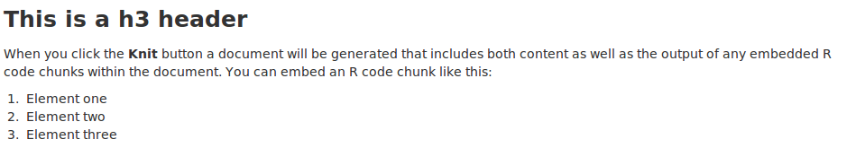

---

## Markdown Syntax (lists)
  
* Bullet list 
    * symbols: *, +, -, 
    * nesting with 4 spaces

```
* Element one
* Element two
  - Subelement
```

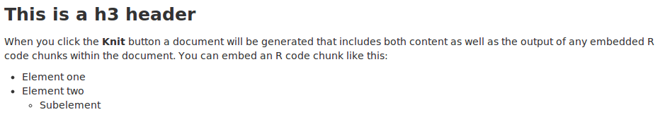

--- bg:#EEE

## Your turn (lists)

1. Create new .Rmd file (file > new > R-Markdown)
1. Edit the metadata section and remove the rest
1. Save the file to desktop
1. Use it to document upcomming tasks in this course
1. Create headers `H1`: "Reproducible Reporting" and `H2`: "Markdown Lists"
1. Create a numbered and a bullet list (try nesting)
1. Knit to HTML
1. What happens if you use only the number `1` in a list? Why?

```
1. Element one
1. Element two
1. Element three
  1. Subelement
```

--- bg:#EEE

## Your turn (lists)

* Markdown is turned into HTML
  - Numbered lists look like this: 
  
```
<ol>
  <li> Element one </li>
  <li> Element two </li>
  <li> Element three </li>
    <ol>
      <li> Subelement </li>
    </ol>
</ol>
```

* Same goes for the bullet lists but `<ul>`
* This shows content and styling are decoupled in HTML
* The styling is done via CSS rules!

---

## Markdown Syntax (emphasis)

```
This is *italic*
```

- This is *italic*
 
```
This is **bold**
```
 
- This is **bold**

```
This is ***bold and italic***
```

- This is ***bold and italic***

* Example
</br>
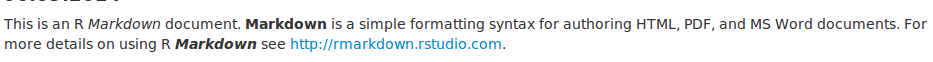

---

## Markdown Syntax (quotes)

* Source


```r
> 42 is the answer to the meaning of life, 
> the universe, and everything.
> – *Douglas Adams*
```

* Output

> 42 is the answer to the meaning of life, 
> the universe, and everything.  
> – *Douglas Adams*

* Example:

</br>
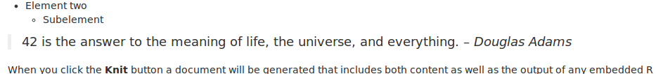

---

## Markdown Syntax (tables)

* Source (align colon)


```r
| Left align | Right align | Center align |
|:-----------|------------:|:------------:|
| This       |        This |     This     |
| column     |      column |    column    |
| left       |       right |    center    |
```

* Output

| Left align | Right align | Center align |
|:-----------|------------:|:------------:|
| This       |        This |     This     |
| column     |      column |    column    |
| left       |       right |    center    |

---

## Markdown Syntax (links)

* URL or path

  ```
  [link text](url or relative path "Some Text")
  ```
  
  - https://github.com/
  - pages/test.html

* Example 

  ```
  [GitHub](https://github.com/ "Build software better, together.")
  ```
  
  [GitHub](https://github.com/ "Build software better, together.")

* You can also simply paste in URLs `https://github.com/` (see above)

---

## Markdown Syntax (links)

* Links as References
  - Reference sections/figures/tables
  - Not as sophisticated as Microsoft Word, Open Office, LaTeX
  - But you can use HTML anchors

* Set anchor

  ```
  <!-- set an html anchor -->
  <a name="abcd"></a>
  ```
  
* Set reference in text

  ```
  <!-- refer in markdown syntax -->
  [link text](#abcd)
  ```

--- bg:#EEE

## Your turn (tables, links, emphasis)

1. Create `H2` header: "Markdown Tables"
1. Create table
  - Align (left, center, left)
  - highlight the words (bold, italic)
1. Create a link to http://www.gbif.de/ display the text "gbif"

  | Left align | Center align | Left align |
  |:-----------|:------------:|:-----------|
  | This is    |   his is     | This       |
  | right      |   *italic*   | **bold**   |
  | aligned    |  center      | [gbif](http://www.gbif.de/) |

1. Knit to HTML to see the result

<a href="https://github.com/mixu/markdown-styles" class="btn flushfooter"><i class="icon-book"></i> Style your markdown</a>

--- bg:#EEE

## Your turn (tables, links, emphasis)

* Source

```
| Left align | Center align | Left align |
|:-----------|:------------:|:-----------|
| This is    |   his is     | This       |
| right      |   *italic*   | **bold**   |
| aligned    |  center      | [gbif](http://www.gbif.de/) |
```

* Output

| Left align | Center align | Left align |
|:-----------|:------------:|:-----------|
| This is    |   his is     | This       |
| right      |   *italic*   | **bold**   |
| aligned    |  center      | [gbif](http://www.gbif.de/) |

---

## Markdown Syntax (images)

```

```


* No direct control over size (HTML)

> ``

<a href="http://bit.ly/1hI3LFC" class="btn flushfooter"><i class="icon-picture"></i> Image Source</a>

---

## Markdown Syntax (formulas)

* Not in basic markdown 
  - Need external tools (here mathjax)
* Inline formulas `$ ... $`
* Display formulas `$$ ... $$` (`<div> formula </div>`)
 
```
$$V_t(S_t) = \max_{x_t \in \chi_t} \left(C(S_t, x_t) + 
            \gamma \sum_{s^{\prime} \in \mathcal{S}}  
            \mathbb{P}(s^{\prime} | S_t^n, x_t)  
            V_{t+1}^{n-1} s^{\prime} \right)$$
```

<div>$$V_t(S_t) = \max_{x_t \in \chi_t} \left(C(S_t, x_t) + 
            \gamma \sum_{s^{\prime} \in \mathcal{S}} \mathbb{P}(s^{\prime} | S_t^n, x_t) V_{t+1}^{n-1} s^{\prime} \right)$$</div>

<div class = "flushfooter">
<a href="http://bit.ly/5OfRvi" class="btn"><i class="icon-home"></i> Mathjax Home</a> <a href="http://bit.ly/2iGPm" class="btn"><i class="icon-book"></i> Formula Syntax</a> <a href="http://detexify.kirelabs.org/classify.html" class="btn"><i class="icon-home"></i> Detexify</a>
</div>


--- 

## Markdown Syntax (code)

* code blocks (3 Backticks)

  \`\`\`  
  Text or code goes here  
  \`\`\`  
    
  ``` 
  myfunction <- function(x,y){
                  z <- x+y;       
                  return(z)     
                } 
  ```

* In line `code`

  ```
  In text `code` hightlight
  ```

---  

## R-Markdown Syntax (code chunks)

* Put your code into:

A code blocks plus (curly braces, r, options)

    ```{r preparation, cache = TRUE, include = TRUE, echo = TRUE}
    x = c(1,2,3,4,5)
    y = summary(x)
    ```

* Modify how the chunk is treated (chunk options)
  - include = FALSE (to include chunk in output)
  - echo = FALSE (include source code)
  - cache = TRUE (cache chunk)
  - ...

<a href="http://yihui.name/knitr/options#chunk_options" class="btn flushfooter"><i class="icon-book"></i> Knitr chunk options</a>

---

## R-Markdown Syntax (inline code)

Prepare Code:

Option: `include = FALSE`


    ```{r preparation, include = F}
    x = c(1,2,3,4,5)
    mean_of_x = mean(x)
    ```
    
Use in your text with inline code chunks:

```
Lorem ipsum dolor sit ` r x + 10` amet, consetetur sadipscing  
elitr, the mean of x is ` r mean_of_x` ...
```

Lorem ipsum dolor sit 11, 12, 13, 14, 15 amet, consetetur sadipscing  
elitr, the mean of x is 3 ...

--- 

## R-Markdown Syntax (plots)

* Options
  - figure.width 
  - figure.height
  - fig.align [center, left, right]
  
Example plot:

    ```{r how_to_include_plots, fig.width = 8, fig.height = 5, fig.align = 'center'}
    require(ggplot2)
    qplot(Sepal.Length, Petal.Length, data = iris, color = Species,
              xlab = "Sepal Length", ylab = "Petal Length",
              main = "Sepal vs. Petal Length in Fisher's Iris data")
    ```

* The width and height are in inch!

---

## R-Markdown Syntax (plots)


```r
qplot(Sepal.Length, Petal.Length, data = iris, color = Species,
  xlab = "Sepal Length", ylab = "Petal Length",
  main = "Sepal vs. Petal Length in Fisher's Iris data")
```

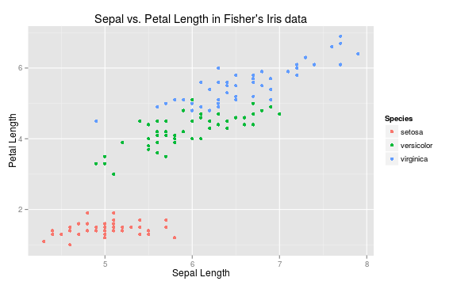

--- bg:#EEE

## Your turn (plots)

1. Create `H2` header: e.g "R-Markdown" and `H3`: e.g "Plots"
1. Create a chunk that is not displayed! (hint: include)
  - load the `ggplot2` package in that chunk
1. Create another chunk (use `qplot`)
  - Dataset `mtcars`
  - x = mpg (miles per US galon)
  - y = wt (weight in lb (pound))
  - if you like map cyl (cylinders) to color
1. Knit to HTML
1. Play around with the alignment and size options!
  - center the plot!
  - resize till it looks correct

--- bg:#EEE

## Your turn (plots)

The preparation chunk:
  
    ```{r preparation, include = F}
    require(ggplot2)
    ```
    
Needs option: `include = FALSE`

* If startup messages appear use:

```
suppressPackageStartupMessages(library(gdata))
```

--- bg:#EEE  

## Your turn (plots)

The plot chunk:


    ```{r plotchunk, fig.align = 'center', fig.width = 6, fig.height = 4}
    qplot(mpg, wt, data=mtcars, colour=cyl)
    ```

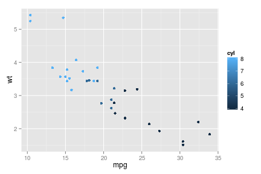

---

## R-Markdown Syntax (tables)

* Knitr can create markdown tables for you!  

needs chunk option: `results = 'asis'`

    ```{r results = 'asis'}
    kable(head(iris[,1:3]), format = "markdown")   
    ```

* kable parameters:
  - `align = c("c", "l", "r")`
  - `digits = 3` 
  - `row.names = T/F`

---

## R-Markdown Syntax (tables)

* Knitr can create markdown tables for you!
  - needs chunk option: `results = 'asis'`


```r
kable(head(iris[,1:3]), format = "markdown")
```


| Sepal.Length| Sepal.Width| Petal.Length|
|------------:|-----------:|------------:|
|          5.1|         3.5|          1.4|
|          4.9|         3.0|          1.4|
|          4.7|         3.2|          1.3|
|          4.6|         3.1|          1.5|
|          5.0|         3.6|          1.4|
|          5.4|         3.9|          1.7|

--- bg:#EEE

## Your turn (tables)

1. Create `H3` header: e.g "Automagical Tables"
1. Create a chunk that is not shown! (hint: include)
  - 
  - prepare 7 first rows of the `mtcars` dataset in a variable (hint: head)
1. Create another chunk
  - use kable to display the 7 rows (hint: asis) 
  - truncate the digits to 1
1. Knit to HTML


--- bg:#EEE

## Your turn (tables)

The preparation chunk:
  
    ```{r preparation, include = F}
    subset_of_mtcars = head(mtcars, 7)
    ```

* sets `include = F` 

The table chunk:

    ```{r themagictable, results = 'asis'}
    kable(subset_of_mtcars, format = "markdown", digits = 1)
    ```

* as output is markdown `results = 'asis'`
* truncate `digits = 1`

--- bg:#EEE  

## Your turn (tables)

The table:


```r
kable(subset_of_mtcars, format = "markdown", digits = 1)
```


|                  |  mpg| cyl| disp|  hp| drat|  wt| qsec| vs| am| gear| carb|
|:-----------------|----:|---:|----:|---:|----:|---:|----:|--:|--:|----:|----:|
|Mazda RX4         | 21.0|   6|  160| 110|  3.9| 2.6| 16.5|  0|  1|    4|    4|
|Mazda RX4 Wag     | 21.0|   6|  160| 110|  3.9| 2.9| 17.0|  0|  1|    4|    4|
|Datsun 710        | 22.8|   4|  108|  93|  3.8| 2.3| 18.6|  1|  1|    4|    1|
|Hornet 4 Drive    | 21.4|   6|  258| 110|  3.1| 3.2| 19.4|  1|  0|    3|    1|
|Hornet Sportabout | 18.7|   8|  360| 175|  3.1| 3.4| 17.0|  0|  0|    3|    2|
|Valiant           | 18.1|   6|  225| 105|  2.8| 3.5| 20.2|  1|  0|    3|    1|
|Duster 360        | 14.3|   8|  360| 245|  3.2| 3.6| 15.8|  0|  0|    3|    4|

--- bg:#EEE

## Your turn (tables GFOE 2014)

* Create `H3` header: e.g "Automagical Tables"
* Create a chunk that is not shown!
  * load the `rbefdata` package (require)
  * set the options (cretentials, URL, bef.options)
  * download the datasets (proposal #1)

```
bef.portal.get.datasets.for_proposal()
```

* Create another chunk
  * use kable to display the 7 rows (hint: asis)
* Knit to HTML


---

## Can I publish markdown?

* GitHub (Software Development Platform)
  - Version management based on Git
  - Github Pages (used for this presentation!)
  
    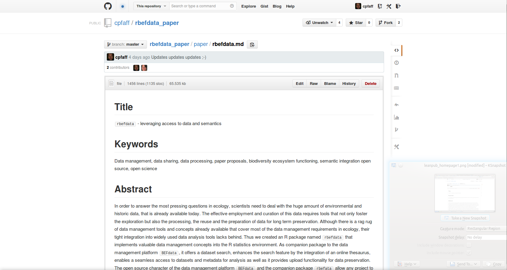  

---

## Can I publish markdown?

* RStudio and RPubs

  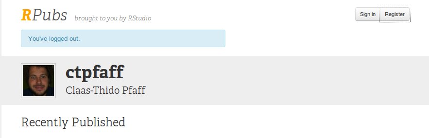  

* Howto?
  - Knit: .Rmd -> .md -> .html
  - In preview click publish (needs account!)
  
    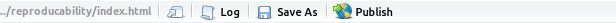  

---

## Can I publish markdown?

* No journal accepts markdown! (afaik)
* Authorea (Online Editor)
  - Harvard University and the Harvard-Smithsonian Center for Astrophysics

    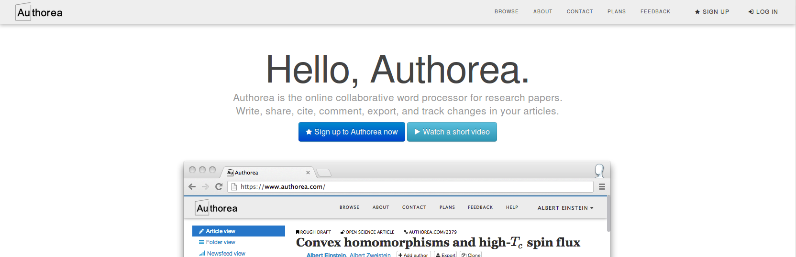

<a href="http://bit.ly/169PcSY" class="btn flushfooter"><i class="icon-home"></i> Authorea</a>

---

## Can I publish markdown?

* But a few accept LaTeX!
* Authorea (Online Editor)
  - Write in md export to LaTeX

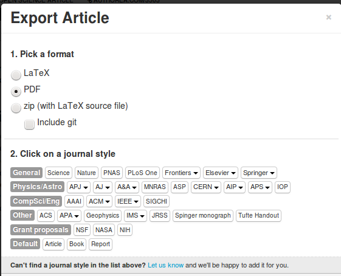

<div class = "flushfooter">
  <a href="http://bit.ly/169PcSY" class="btn"><i class="icon-home"></i> Authorea</a> <a href="http://johnmacfarlane.net/pandoc/" class="btn"><i class="icon-home"></i> Pandoc</a>
</div>

--- 

## Where else markdown is used?

* Leanpub (Publish your books!)

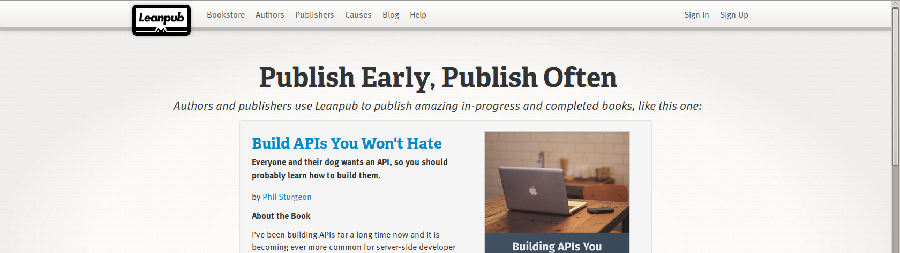

* Advanced Programming in R (Hadley Wickham, knitr, mardown, pandoc etc..)

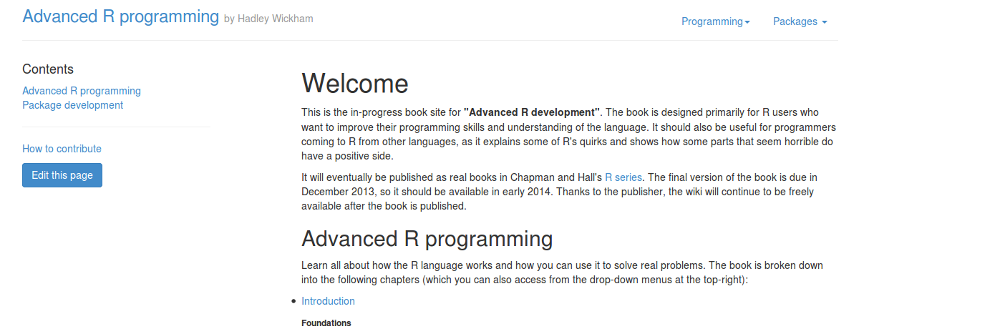

<div class="flushfooter">
  <a href="https://leanpub.com" class="btn"><i class="icon-home"></i> Leanpub</a> <a href="http://adv-r.had.co.nz/" class="btn"><i class="icon-book"></i> Advanced R Programming</a>
<div>

--- bg:#EEE 

## Prepare for LaTeX and Knitr

* Install Latex
  - for PDF report generation

* MikTeX (Windows)
  - Basic LaTeX-Distribution

* Install instruction
  - Choose a location to install
  - Preferred paper (A4)
  - Install missing packages (ask me first)
 
* Mac users can choose `MacTeX` 
* Linux users can install `TeXlive` (package manager)


<div class = "flushfooter">
<a href="http://mirror.ctan.org/systems/mac/mactex/MacTeX.pkg" class="btn"><i class="icon-download"></i> MacTeX (Mac)</a> <a href="http://mirrors.ctan.org/systems/win32/miktex/setup/basic-miktex-2.9.4813.exe" class="btn"><i class="icon-download"></i> MikTeX (Windows)</a>
</div>

--- bg:#EEE

## Prepare for LaTeX and Knitr

* Integration: 
  - Tools > Options > Sweave (Select knitr)

      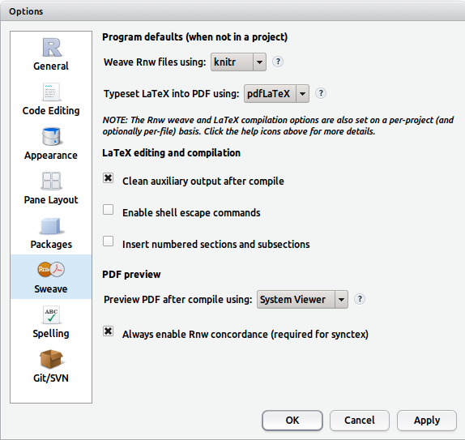

---

## LaTeX and R-Studio

* Integration:
  * File > new > R Sweave (LaTeX + Noweb)

```
% preamble
\documentclass{article, report, book, letter}

% load packages here/general layout

% document body
\begin{document}

Some text ...

\end{document}
```

 - Content sensitive navigation options and syntax help:

      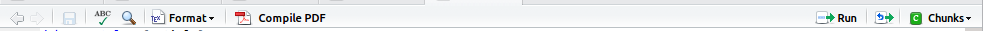

---

## LaTeX Syntax

* Environments

  ```
  \begin{environment}
    Some text affected by the environment
  \end{environment}
  ```

  - like `\begin{document} ... \end{document}`

* Commands

  ```
  \command{some text} 
  ```

  - like \textbf{bold face text here}

--- 

## LaTeX Syntax (title page)

* Title page

* Commands (preamble) 
  - \title{}
  - \author{}
  - \date{}

```
% preamble
\title{The Triangulation of Titling Data in
       Non-Linear Gaussian Fashion via $\rho$ Series}
\date{October 31, 475}
\author{John Doe \\ Magic Department, Richard Miles University}
```

* In document body use `\maketitle`

---  bg:#EEE

## Your turn (title page)

* Create new R Sweave file in RStudio
  - save file into own folder! (name it e.g  `mydocumentation.Rnw`)
  - if you have `\SweaveOpts{...}` in there delete it!
* Not all classes have a title page by default!
  * change to other class e.g to `report`
  * or modify with options `\documentclass[titlepage]{article}`
* Add some example
  * Title
  * Author
  * Date 
* Knit it to PDF

<div class = "flushfooter">
<a href="http://www.namsu.de/latex/kapitel3_6.html" class="btn"><i class="icon-book"></i> LaTeX (Title-Pages)</a> 
</div>

---

## LaTeX Syntax

* Headers

```
\part{}
\chapter{} % missing in report
\section{} 
\subsection{}
\subsubsection{}
\paragraph{}
\subparagraph{}
```

* Lists (itemize, enumerate, description `\item[highlighted] some text`)

```
\begin{itemize}
  \item Element One
  \item Element Two
\end{itemize}
```

--- 

## LaTeX Syntax

```
\textrm{roman text}
\textsf{serif text}
\textbf{bold face text}
\textit{italic text} 
\textsl{slanted text}
\emph{emphasized text}
```

* what is the difference between italic/slanted?
* emph is cool
  - always emphasies no matter where your use it

<div class = "flushfooter">
<a href="http://www.stdout.org/~winston/latex/latexsheet.pdf" class="btn"><i class="icon-download"></i> LaTeX (Cheat-Sheet)</a> 
</div>

---

## LaTeX Syntax

* Code blocks (verbatim)

```
\begin{verbatim}
def say_hello(name)
   greeting_string = "Hello #{name}"
   return greeting_string
end
\end{verbatim}
```

* Preserve line breaks
  - and indent

```
def say_hello(name)
   greeting_string = "Hello #{name}"
   return greeting_string
end
```

---

## Do you remember? 

Markdown code chunks:

    ```{r preparation, include = F}
    x = c(1,2,3,4,5)
    mean_of_x = mean(x)
    ```

And inline code?
    
```
Lorem ipsum dolor sit ` r x + 10` amet, consetetur sadipscing  
elitr, the mean of x is ` r mean_of_x` ...
```

--- 

## Same same but different?

* LaTeX Code chunks
  - syntax different 
  - function the same

```
<<name, key = value>>=
  add your R code here!
@
```

* Inline code with

```
\Sexpr{your r code}
```

---

## LaTeX Syntax

* Code chunks example

```
\section{Results}

<<results, include = F>>=
  a = c(1,2,3,4,5,5)
  b = mean(a)
@
```

* And inline code

```
Lorem ipsum dolor the mean of a is \Sexpr{b} sit amet...
```

* NOTE: do not use this to extensively if not necessary!
  - can cluter your source 
  - hard to read

---

## LaTeX Syntax

* figures

```
\begin{figure}[htbp]
  \centering
    \includegraphics[width=0.5\textwidth]{gull.png}
    \caption{A picture of a gull}
\end{figure}
```

* supported formats (pdflatex)
  - jpg
  - png
  - PDF
  - EPS

---  bg:#EEE

## Your turn (lists, figures)

* Create `section` (Reproducible reporting)
* Create `subsection` (lists)
* Create a bullet list and a numbered list (try to nest it)
* Create `subsection` (figures)
* Download the figure (button below)
* Place it e.g into a `figure` folder in your document folder
* Include it
  * center
  * give a caption
* Knit to PDF
* resize `width` parameter (if necessary, Xcm, Xpx, Xin, etc.)

<div class = "flushfooter">
  <a href="http://latex.tugraz.at/latex/tutorial" class="btn"><i class="icon-book"></i> LaTeX Syntax</a> <a href="assets/img/deep_thought.png" class="btn"><i class="icon-download"></i> Get figure</a>
</div>

---  bg:#EEE

## Your turn (lists, figures)

```
\begin{figure}[htbp]
  \centering
    \includegraphics[width=0.5\textwidth]{figure/deep_thought.png}
    \caption{This is the Deep Thought computer}
\end{figure}
```

```
\begin{itemize}
  \item Element One
    \begin{itemize}
      \item Nested Element
    \end{itemize}
  \item Element Two
\end{itemize}
```

---

## LaTeX Syntax (tables)

- alignment l,c,r
- fields separated by &
- line end \\\

```
\begin{table}[htbp]
  \begin{tabular}{lrc}
    1 & 2 & 3 \\
    4 & 5 & 6 \\
    7 & 8 & 9 \\
  \end{tabular}
\end{table}
```

* knitr `kable()` to the rescue! (try booktabs)

```
kable(head(iris[,1:3]), format = "latex", booktabs)
```

---  bg:#EEE

## Your turn (tables)

* Create `subsection` (tables)
* Create a code chunk not shown in text and prepare
  - from iris dataset (10 rows and column 1 to 4)
* Create another code chunk
  - use `kable` to generate a latex table from prepared dataset
* Knit to PDF
* include the booktabs package in preamble `\usepackage{booktabs}`
* set `kable` option `booktabs = T` 
* Knit to PDF
* Wrap chunk into table environment (hint chunk option `echo = F`)
  - center `\centering`
  - give a caption

<div class = "flushfooter">
  <a href="http://latex.tugraz.at/latex/tutorial" class="btn"><i class="icon-book"></i> LaTeX Syntax</a> <a href="http://yihui.name/knitr/demo/minimal/" class="btn"><i class="icon-book"></i> Minimal example (with kable)</a>
</div>

--- bg:#EEE

## Your turn (tables)

```
<<prepare, include = F>>=
  require(knitr)
  iris_prepared = head(iris[,1:4], 10)
@
```

```
\begin{table}[htbp]
  \centering
  \caption{Testcaption}
  <<table, results = 'asis', echo = F>>=
  kable(iris_prepared, format = "latex", booktabs = T)
@
\end{table}
```

---

## LaTeX Syntax

* Links (URL)
  - reuiqres `\usepackage{hyperref}`

```
\url{<my_url>}
\href{<my_url>}{<description>}
```

* References: via label <-> reference mechanism

```
\begin{figure}[htbp]
  \centering
    \includegraphics[width=0.5\textwidth]{gull.png}
    \caption{A picture of a gull}
    \label{fig:mylabel}
\end{figure}
```

Lorem ipsum dolor sit amet, `\ref{fig:mylabel}` consetetur sadipscing elitr, 

---

## LaTeX Syntax

* Contents
  - based on sectioning commands

```
\tableofcontents
```

* List of figures
  - based on `\captions{}`

```
\listoffigures
```

* List of figures
  - based on `\captions{}`
  
```
\listoftables
```

--- bg:#EEE

## Your turn (contents)

* generate a 
  - table of contents
  - list of figures
  - list of tables
* knit to PDF
* add a new page after the contents if necessary
  `\newpage`
* knit to PDF

--- 

## Include online repositories!

* rOpenSci (community, R package development, wrapping science APIs)

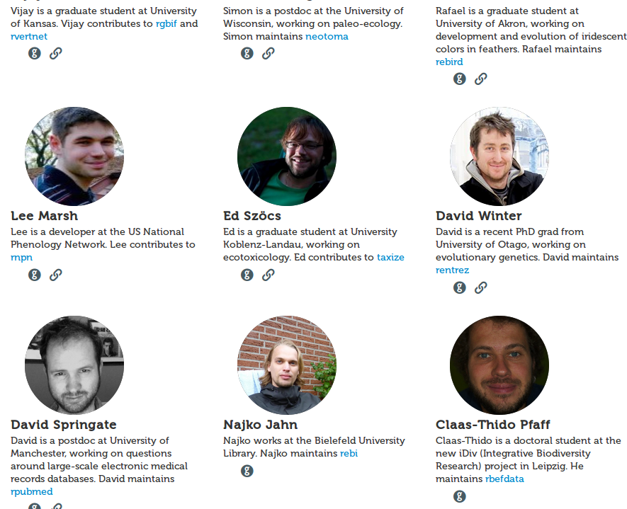

* Packages e.g 
  - Dryad (Data publishing service), Mendeley (Citations)
  - `taxize` (species name resolver), GBif (Species Distribution Data)

<div class = "flushfooter">
  <a href="http://ropensci.org" class="btn"><i class="icon-home"></i> rOpenSci</a>
</div>

---

## Include online repositories!

* Example from my Open-Science-Paper LaTeX class

```
\ospFramedEnv*[label = fig:distmap]{
<<distmap_two, fig.width=10, fig.height=5, echo=FALSE, message=FALSE>>=
  osp_distmap(species=c('Accipiter erythronemius', 'Junco hyemalis', 'Aix sponsa'))
@
}{Lorem ipsum dolor sit amet, Brautente, . Aenean
  commodo ligula eget dolor. Aenean massa. Cum sociis natoque penatibus et magnis
  dis parturient montes, nascetur ridiculus mus. Donec quam felis, ultricies nec,
  pellentesque eu, pretium quis, sem.}
```

* Own enviroment 

`\ospFramedEnv*[options]{code chunk}{caption text}`

* Own R function to fetch species data (GBIF)

`osp_distmap(species=c('Accipiter erythronemius', 'Junco hyemalis', 'Aix sponsa'))`

<div class = "flushfooter">
  <a href="https://github.com/cpfaff/Open-Science-Paper" class="btn"><i class="icon-home"></i> Open-Science-Paper</a> <a href="http://www.gbif.de/" class="btn"><i class="icon-home"></i> GBIF</a>
</div>

---

## Include online repositories!

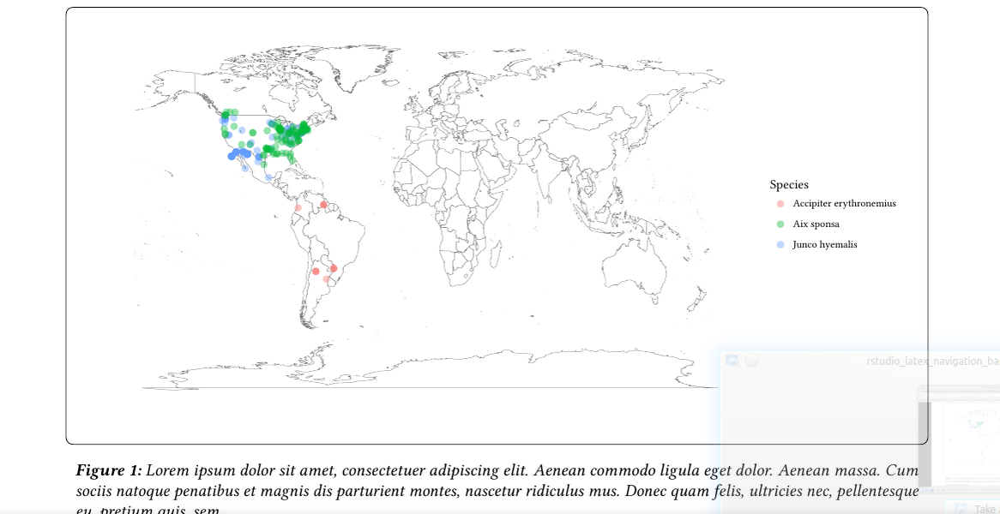

<div class = "flushfooter">
  <a href="https://github.com/cpfaff/Open-Science-Paper" class="btn"><i class="icon-home"></i> Open-Science-Paper</a> <a href="http://www.gbif.de/" class="btn"><i class="icon-home"></i> GBIF</a>
</div>

---

## How does this work in detail?

* LaTeX Code

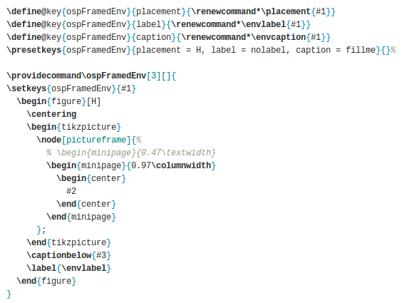

* R-Function

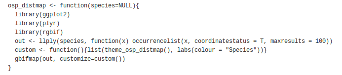

<div class = "flushfooter">
  <a href="https://github.com/cpfaff/Open-Science-Paper/blob/master/usr/subdocuments/options/osp_global_r_options.Rnw" class="btn"><i class="icon-book"></i> R-Function</a> <a href="https://github.com/cpfaff/Open-Science-Paper/blob/master/osp/subdocuments/open_science_paper.cls" class="btn"><i class="icon-book"></i> LaTeX Code</a>
</div>

---

## Wrapup: Which format to choose?

* Markdown
  - designed to write for the web
  - easy to learn and write
  - Syntax: http://daringfireball.net/projects/markdown/
  - but has its limitations (e.g. figure size, references)
  - markdown flavours support more features (multidoc)
  
> What happens if you ask for too much power from Markdown?  
> – *Yihui Xie*  


      
<div class = "flushfooter">
  <a href="http://yihui.name/en/2013/10/markdown-or-latex/" class="btn"><i class="icon-picture"></i> Blog-Post (Yihui)</a>
</div>

---

## Wrapup: Which format to choose?

* LaTeX
  - designed to create PDF
  - harder to learn and write
  - choose if you need to print it!
  - books e.g LaTeX Companion (Frank Mittelbach, Michael Goossens)
  - good classes available (open-science-thesis, papaper, koma-script)

</br>
</br>
</br>
</br>

<div class = "flushfooter">
  <a href="http://yihui.name/en/2013/10/markdown-or-latex/" class="btn"><i class="icon-picture"></i> Blog-Post (Yihui)</a> <a href="http://www.stdout.org/~winston/latex/latexsheet.pdf" class="btn"><i class="icon-download"></i> LaTeX (Cheat-Sheet)</a> <a href="http://latex.tugraz.at/latex/tutorial" class="btn"><i class="icon-book"></i> LaTeX Tutorial</a> 
</div>

--- bg:#EEE

## Reproduce this slides!

* download the slides (button below!)

* unzip the archive

* Open the folder
  - open in Rstudio: `index.Rmd` 

* Knit it to HTML!

<a href="https://github.com/cpfaff/reproducibility/archive/gh-pages.zip" class="btn flushfooter"><i class="icon-download"></i> Get this presentation</a>  

--- bg:#EEE

## Reproduce this slides!

* Install prerequisites

```
# the devtools package
install.packages("devtools")
require(devtools)
# Install slidify from github
install_github('slidify', 'ramnathv')
install_github('slidifyLibraries', 'ramnathv')
require(slidify)
```

* NOTE: Do not write into the file you downloaded!

* Knit to HTML again

---

<div class = "flushcenter">
     <h1>Thanks for your attention!</h1>
</div>

<a href="https://github.com/cpfaff/reproducibility/archive/gh-pages.zip" class="btn flushfooter"><i class="icon-download"></i> Get this presentation</a>  

---

--- bg:#EEE

## What is reproducible reporting?

* Open your R-Studio (+ new R script)

* try: 

```
require(knitr)
require(rmarkdown)
require(ggplot2)
```

* Create a folder on your desktop (mylibrary)

* Add that folder to you library paths in R

```
.libPaths( c( .libPaths(), "c:/users/username/desktop/mylibrary"))
```

* Install the requirements

```
install.packages(c("knitr", "rmakrdown", "ggplot2"), lib = "c:/users/username/desktop/mylibrary")
```
